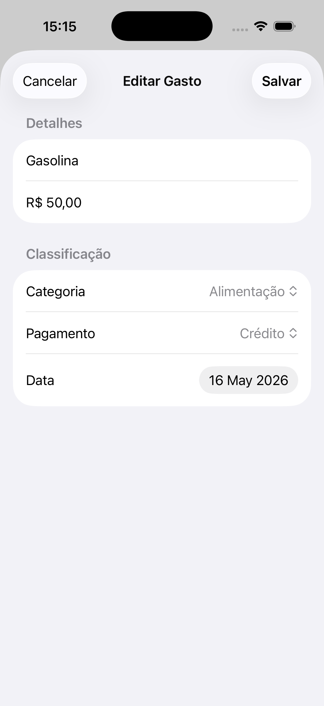

# MeuDinheiro — iOS

A personal finance tracker for iOS built with **SwiftUI**, featuring **offline-first sync**
and the ability to log expenses straight from a WhatsApp conversation, parsed by AI.

## What it does

- Track expenses and income with categories, payment methods, and credit card billing cycles.
- Log expenses by sending a text or voice message on WhatsApp — the [backend](https://github.com/Bruques/Meu-Dinheiro-Backend)
  transcribes/parses it with Gemini and syncs it back to the app.
- Works fully offline: expenses created without a connection are queued locally and synced
  automatically once the network is back, with deduplication between local and server IDs.
- Firebase Authentication for sign-in.

## Screenshots

 

## Architecture

Layered MVVM, organized by responsibility rather than by screen alone:

```
Domain/         Models and protocols (AuthServiceProtocol, ExpenseRepositoryProtocol)
Data/Network/   Repository + service implementations, offline sync manager
Presentation/   One folder per feature (Login, Dashboard, AddExpense, EditExpense, Settings),
                each with a View + ViewModel
```

- Dependencies are expressed as protocols (`AuthServiceProtocol`, `ExpenseRepositoryProtocol`)
  and injected into ViewModels, which makes them unit-testable in isolation — see
  `MeuDinheiroiOSTests/LoginViewModelTests.swift` for an example with a mocked auth service.
- Local persistence via **SwiftData**; `SyncManager` reconciles local and remote state.
- 100% `async/await`, no completion-handler callbacks; `@MainActor` on ViewModels.

## Tech stack

Swift · SwiftUI · SwiftData · Combine · Firebase Auth · XCTest

## Backend

This app talks to a companion Spring Boot API: [Meu-Dinheiro-Backend](https://github.com/Bruques/Meu-Dinheiro-Backend),
which also handles the WhatsApp webhook and AI-based expense parsing.

## Status

Actively developed. Known gaps: test coverage currently focuses on the login flow; the
expense repository (where the offline sync logic lives) is not yet covered by tests.
